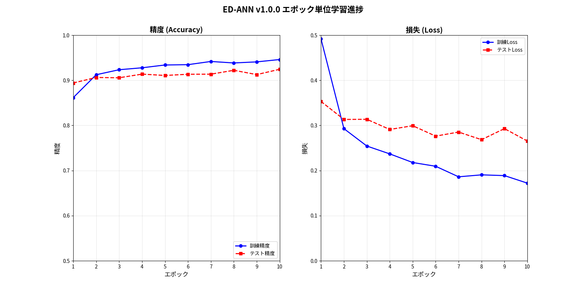

# ED法を用いたANNネットワークのマルチクラス分類法

## 概要

今回の実装にあたり、従来のED(Error Diffusion)法は二値分類を行う機能であるという前提に立ちました。この前提に立つと従来のED法そのままではマルチクラス対応にできないため、従来のED法の重み構造を拡張してマルチクラス分類に対応させたというものになります。

**バージョン**: v1.0.1 - グラフカスタマイゼーション機能追加版

## 特徴

- **従来のED法の拡張**: 従来のED法の重み構造の拡張により、マルチクラス分類に対応
- **重み選択メカニズム**: クラス別専用重み配列を用いて、クラス別ネットワークを構築
- **リアルタイム可視化**: 学習進捗をリアルタイムでグラフ表示（カスタマイズ可能なウィンドウサイズ）
- **MNIST対応**: 手書き数字認識（10クラス分類）を用いた実装
- **PyTorchベース**: 代表的な機械学習フレームワークによる実装

## インストール方法

### 必要な環境
- Python 3.8以上
- PyTorch
- torchvision
- matplotlib
- numpy

## インストール手順

```bash
# リポジトリをクローン
git clone https://github.com/yoiwa0714/ed-ann.git
cd ed-ann

# 仮想環境の作成（推奨）
python -m venv .venv
source .venv/bin/activate  # Linux/Mac
# または
.venv\Scripts\activate  # Windows

# 依存関係のインストール
pip install torch torchvision matplotlib numpy
```

### [インストールにあたってのご注意]

- クローン後すぐに利用できるようにMNISTデータも含んだ構成としています。MNISTデータが不要な場合にはクローン後に削除をお願いします。

## 使用方法

### 基本的な使用例

```bash
# MNISTデータでの学習実行（デフォルト設定）
python ed_ann_simple_v100.py

# ヘルプオプションで利用可能なオプションを確認
python ed_ann_simple_v100.py --help

# 基本的なパラメータ調整例
python ed_ann_simple_v100.py --epochs 5 --learning_rate 0.005 --batch_size 64
```

プログラム内では以下のような構成になっています：

```python
# マルチクラスED-ANNモデルの初期化
model = MulticlassEDANN(input_size=784, hidden_size=64, num_classes=10)

# MNIST学習の実行
# - 学習モード（epoch/class/both）をコマンドラインで選択可能
# - 各種パラメータはコマンドラインオプションで設定可能
```

### オプション設定例

#### 基本的なパラメータ調整

```bash
# エポック数とバッチサイズを調整
python ed_ann_simple_v100.py --epochs 10 --batch_size 128

# 学習率と隠れ層サイズを調整
python ed_ann_simple_v100.py --learning_rate 0.005 --hidden_size 128

# クラス別データ数を調整（高速テスト用）
python ed_ann_simple_v100.py --train_size 100 --test_size 50

# 大規模データセットでの学習
python ed_ann_simple_v100.py --train_size 5000 --test_size 1000 --epochs 10

# CPU強制使用での実行
python ed_ann_simple_v100.py --cpu

# 詳細ログとリアルタイム表示を有効化
python ed_ann_simple_v100.py --verbose --realtime

# シード値を指定して再現可能な実行
python ed_ann_simple_v100.py --seed 42

# シード値を指定しない場合はランダム値が自動生成される
python ed_ann_simple_v100.py  # 毎回異なるランダムシードで実行
```

#### 学習モード選択

```bash
# エポック単位学習（デフォルト）
python ed_ann_simple_v100.py --mode epoch

# クラス単位学習
python ed_ann_simple_v100.py --mode class

# 両方のモードで比較実行
python ed_ann_simple_v100.py --mode both
```

### カスタマイズオプション

`ed_ann_simple_v100.py`では以下のコマンドラインオプションが利用可能です：

#### 基本パラメータ
- `--epochs`: 訓練エポック数（デフォルト: 3）
- `--learning_rate`: 学習率（デフォルト: 0.01）  
- `--batch_size`: バッチサイズ（デフォルト: 32）
- `--hidden_size`: 隠れ層サイズ（デフォルト: 64）
- `--train_size`: クラス別訓練データ数（デフォルト: 1000）
- `--test_size`: クラス別テストデータ数（デフォルト: 1000）

#### 実行モード・オプション
- `--mode`: 学習モード選択（デフォルト: epoch）
  - `epoch`: エポック単位学習
  - `class`: クラス単位学習  
  - `both`: 比較実行
- `--realtime`: リアルタイム学習表示の有効化
- `--verbose`: 詳細ログ表示の有効化
- `--verify`: 精度検証機能（結果CSV書き出し）の有効化

#### システム設定
- `--cpu`: CPU強制使用（GPU自動判別を無効化）
- `--seed`: シード値（無指定時はランダム値）

### コードに関する補足

- 現在の実装では、隠れ層は1層のみの構成となります。
- 実行開始時に、model.summary風のモデル構造情報が表示されます。
- モデル構造情報に続いて、ED法ハイパーパラメータの設定値が表示されます。
  - ED法ハイパーパラメータの内、コマンドラインオプションで指定できるのはbase_learning_rateのみです。その他のED法ハイパーパラメータを調整するためにはコードを直接編集する必要があります。
  - ED法ハイパーパラメータはclass HyperParametersにまとめて記述されています。class HyperParametersはed_ann_simple_v100.pyの140行目辺りに配置されています。
- リアルタイム可視化グラフの自動保存機能は実装していません。リアルタイム可視化グラフを保存する場合には、グラフウィンドウの左下に表示される保存アイコンを押して保存してください。

## ファイル構成

```
ed-ann/
├── README.md                           # このファイル
├── ed_ann_simple_v100.py               # メインの実行ファイル
├── ed-ann-epoch-based-training-result.png  # 実行結果のサンプル画像
├── data/                               # データディレクトリ
│   └── MNIST/                          # MNISTデータセット保存場所
└── docs/                               # ドキュメント
    ├── multiclass_ed_comprehensive_explanation.md
    ├── 通常のEDネットワーク例.png
    ├── MNIST対応 マルチクラスEDネットワーク.png
    ├── クラス別学習 学習順序.png
    └── エポック順学習 学習順序.png
```

## 動作原理

### 重み選択メカニズム

- 学習対象のすべての重みに、クラス0〜9それぞれに対応した専用の重み配列W[0:9]を用意
  - クラス0用の重みはW[0]、クラス1用の重みはW[1]、、、クラス9用の重みはW[9]
- 正解クラスに対応する重み配列を動的に選択し、選択された重みでクラスに特化したネットワークを構成

### 学習方式

- **クラス別学習**: 各クラス専用データで順次学習
  - クラス専用データは、正解クラスデータ50%、正解クラス以外のデータ50%から構成されています。

- **エポック順学習**: 全クラスデータを混合して学習
  - クラスデータは、各正解ラベルが約10%ずつを占める、通常の学習用データです。

詳細な原理説明は[docs/multiclass_ed_comprehensive_explanation.md](docs/multiclass_ed_comprehensive_explanation.md)をご参照ください。

## カスタマイズ機能

### グラフウィンドウサイズの調整

リアルタイム可視化のグラフウィンドウサイズは、`HyperParameters`クラスで調整できます：

```python
# ed_ann_simple_v100.py内のmain関数で
hyperparams = HyperParameters()
hyperparams.graph_width = 12.0   # 幅（インチ）デフォルト: 16.0
hyperparams.graph_height = 8.0   # 高さ（インチ）デフォルト: 8.0
```

- デフォルト: 16×8インチ（約1280×640ピクセル相当）
- 推奨範囲: 幅 8.0～20.0、高さ 6.0～12.0
- 小さすぎる値（< 6インチ）は文字が読みにくくなる可能性があります

### その他のハイパーパラメータ

```python
hyperparams.d_plus = 0.1        # アミン濃度増加量（正答時）
hyperparams.d_minus = 0.05      # アミン濃度減少量（誤答時）  
hyperparams.base_learning_rate = 0.01  # 基本学習率
```

## 実験結果

MNISTデータセットでの実験により、現在主流の手法と同等以上の分類精度を達成しています。
- 以下は`--realtime`オプションを使用した学習過程のリアルタイム可視化結果です (エポック順学習)：

```bash
python ed_ann_simple_v100.py --train_size 1000 --test_size 1000 --epochs 10 --realtime
```



*グラフ説明: 左側は精度の推移（訓練・テスト）、右側は損失の推移を示しています。*

## 更新履歴

### v1.0.1 (2025-08-23)
- **新機能**: グラフウィンドウサイズのカスタマイゼーション機能を追加
  - `HyperParameters`クラスに`graph_width`、`graph_height`パラメータを追加
  - ユーザーが可視化ウィンドウのサイズを自由に調整可能に
  - 従来の固定サイズ（16×8インチ）から任意のサイズへの変更をサポート
- **改善**: コードの型安全性向上（Optional型注釈の適切な使用）
- **改善**: トレーナークラス間でのハイパーパラメータ共有の統一化

### v1.0.0 (2025-08-17) - 初公開版
- ED法によるマルチクラス分類の基本実装
- PyTorch統合による高効率学習
- リアルタイム可視化機能
- MNIST手書き数字認識による実証実験

## ライセンス

本プロジェクトはMITライセンスの下で公開されています。
