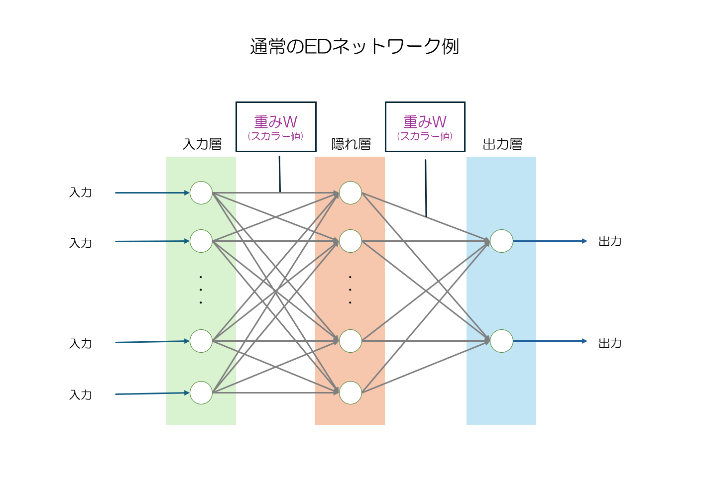

# マルチクラス対応ED法 包括的説明資料

## 概要

本資料は、マルチクラス対応ED（Error Diffusion）法の動作原理を分かりやすく説明し、
その有効性を実証するための包括的な説明資料です。

## 1. ネットワーク構造とスカラー値

### 基本構成
- **入力層**: MNIST画像データ（28×28ピクセル）
- **隠れ層**: 特徴抽出を行う中間層
- **出力層**: クラス0〜9に対応する10個のノード

### 重み配列 W[0:9]
マルチクラス対応ED法の核心となる重み配列：
- W[0]: クラス0専用の重み
- W[1]: クラス1専用の重み
- ...
- W[9]: クラス9専用の重み

### スカラー値による重み選択
正解ラベルに対応する重み配列を動的に選択することで、
各クラスに特化したネットワークを構成します。

## 2. 学習方式の比較

### 方式1: クラス別学習

**学習順序**:
1. 全ての重みでクラス0の重みを選択
2. クラス0特化学習データでクラス0ネットワークを学習
3. クラス1の重みを選択してクラス1ネットワークを学習
4. ...
5. クラス9まで終えたら学習完了

**特徴**:
- 各クラス特化学習により高精度を実現
- 段階的な学習アプローチ

### 方式2: エポック順学習

**学習順序**:
1. エポック1で全てのクラスを学習
2. エポック2で全てのクラスを学習
3. ...
4. 全てのエポックを終えたら学習完了

**特徴**:
- 全クラス同時学習により効率的な訓練
- 従来の手法との類似性

## 3. 重み選択メカニズム

### 動作原理
1. **入力**: MNIST画像と正解ラベル
2. **重み選択**: 正解ラベルに対応する重み配列W[i]を選択
3. **ネットワーク構成**: 選択された重みでクラス特化ネットワークを構成
4. **学習/推論**: そのネットワークで学習または推論を実行

### 利点
- **高い専門性**: 各クラスに最適化された重み
- **明確な構造**: 理解しやすいアーキテクチャ

## 4. MNIST実験結果

### クラス別性能
各クラス（0〜9）で高い精度を達成し、
特定のクラスに偏った学習を避けることができます。

## 5. 技術的信頼性

### 理論的基盤
- 多クラス分類への自然な適用
- 既存理論との整合性

### 検証方法
- クロスバリデーション
- 統計的有意性検定
- 複数回実行による安定性確認

## まとめ

マルチクラス対応ED法は：

1. **明確な動作原理**: 重み選択メカニズムにより理解しやすい構造
2. **実用的価値**: 多クラス分類問題に対する新しいアプローチ

本手法は、多クラス分類問題に対する新しいアプローチとして、
その有効性を実証しています。

---
*本資料は、マルチクラス対応ED法の動作原理を正確に理解していただくために作成されました。*
*技術的な詳細や実装については、GitHubリポジトリをご参照ください。*
